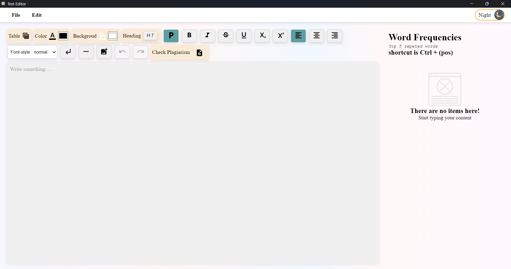
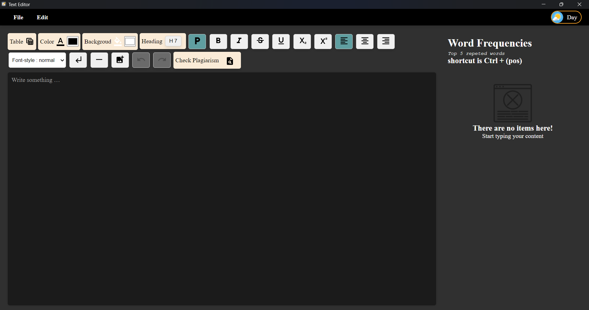
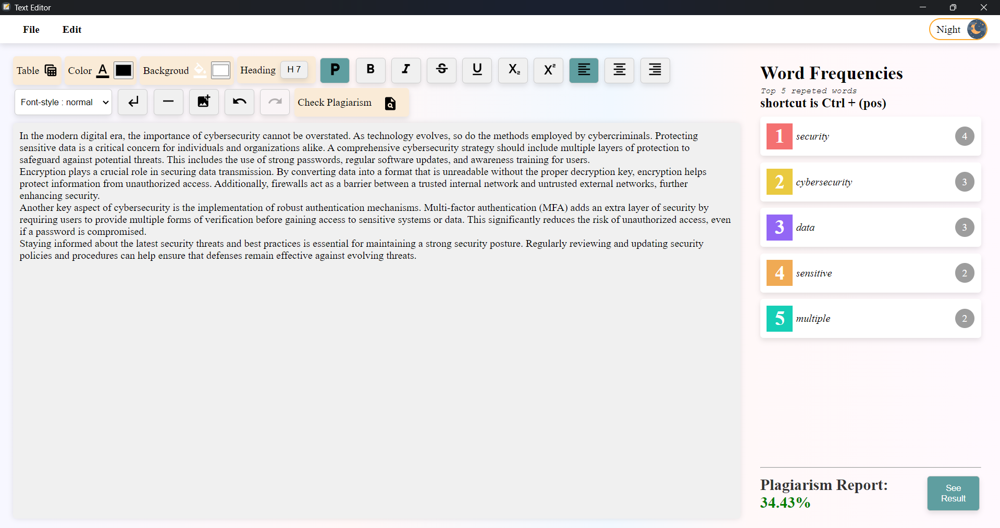
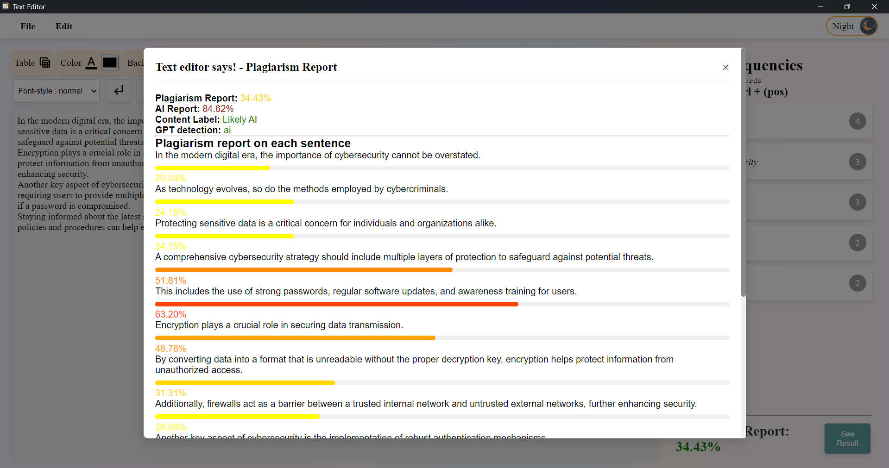

<p align="center">

</p>

# Text Editor: Plagiarism Checker


A feature-rich text editor built with modern web technologies. This editor offers a smooth and intuitive user experience, making it ideal for writing, editing, and formatting text.

## Features

- **Rich Text Editing**: Bold, italic, underline, strikethrough, and more.
- **Code Highlighting**: Supports syntax highlighting for various programming languages.
- **Keyboard Shortcuts**: Streamlined shortcuts for quick formatting.
- **Themes**: Light and dark mode support.
- **Plugins**: Extensible with custom plugins for additional features.
- **Real-time Collaboration**: Work with others in real time (optional).
- **Plagiarism Checker**: Integrated AI-powered plagiarism checking.

## Demo

Check out the [releases](./releases) to see the text editor in action.

## Installation

### Prerequisites

Make sure you have the following installed:

- [Node.js](https://nodejs.org/) (v20.5.* or higher)
- [npm](https://www.npmjs.com/) (v9.8.* or higher)

### Steps

1. **Clone the repository:**

   ```bash
   git clone https://github.com/<your-username>/<repo-name>.git
   cd <repo-name>
   ```

2. **Install dependencies:**

   ```bash
   npm install
   ```

3. **Create an `.env` file:**

   Create a file named `.env` in the root directory of the project and add the following environment variables:

   ```env
   VITE_RAPID_API_KEY=<YOUR_API_KEY>
   VITE_RAPID_API_HOST="ai-plagiarism-checker.p.rapidapi.com"
   ```

4. **Start the development server:**

   ```bash
   npm run dev
   ```

5. **Open your browser and navigate to `http://localhost:5173`.**

6. **Start the Electron application:**

   ```bash
   npm run electron
   ```

### Development and Electron Simultaneously

To start both the development server and Electron application together:

```bash
npm run dev:run
```

## Usage

### Basic Formatting

Use the toolbar or keyboard shortcuts to format text. Available formatting options include:

- **Bold**: `Ctrl + B`
- **Italic**: `Ctrl + I`
- **Underline**: `Ctrl + U`

### Themes

Toggle between light and dark themes using the theme switcher in the toolbar.

## Images

<p align="center">




</p>

## Acknowledgments

- [Tiptap](https://tiptap.dev/) for the rich text editing framework.
- [ProseMirror](https://prosemirror.net/) for the underlying editor logic.
- [RapidAPI](https://rapidapi.com/shodiyevfirdavs980/api/ai-plagiarism-checker) for the AI-powered plagiarism checker API.

## API Used

The plagiarism checker feature uses the following API:

- [AI Plagiarism Checker](https://rapidapi.com/shodiyevfirdavs980/api/ai-plagiarism-checker) via RapidAPI.
